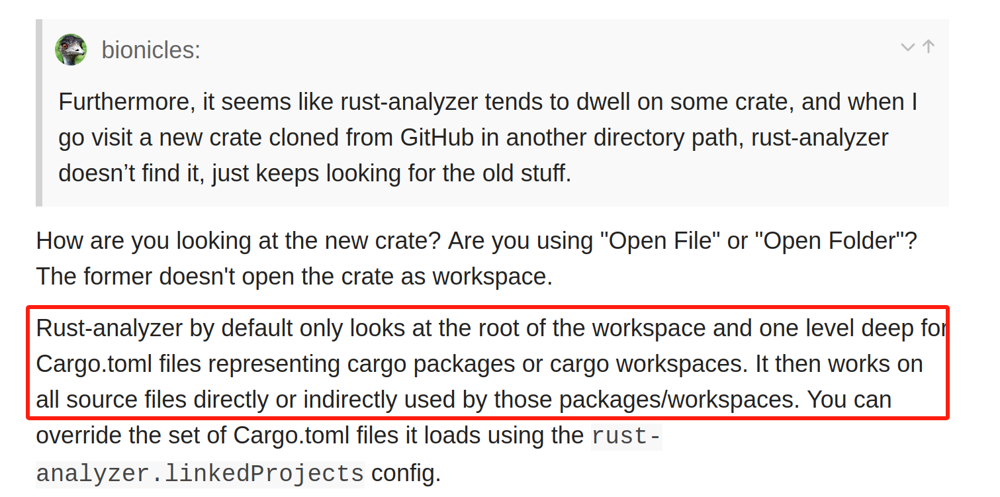

# Computer Study Repository
学习计算机科学与技术中个人编写的各种程序的保存仓库

# TODO List
1. [Learn Git Branching](https://learngitbranching.js.org/?locale=zh_CN) 第一次通关(24/9/25),以后每个月通关一次，直至熟练，在下方打卡。
2. 学习Rust语言 完成时间：
3. 学完OS导论部分 完成时间：
4. RISC-V处理器的指令集和部分特权操作
5. RISC-V汇编语言

# 2024年
## 9月
9/25
* 学习[make](https://www.bilibili.com/video/BV1xC4y1d7Xs/)语法，看完P1-P16。[作者文档笔记](https://www.yuque.com/duguaizheyuese/bufe66/ahal8e5vo39dzdmb?singleDoc#vDerT)
* 学习[Rust](https://simonkorl.gitbook.io/r-z-rustos-guide/dai-ma-zhi-qian/)语法，完成ex1。
* 学习Git分支管理，完成主要关卡，还剩远程关卡。
* 创建分支rust_learn,负责rust学习。

9/27
* 新建分支os_learn,负责计算机导论和rCore课程的课后练习。
* 学习[gdb](https://blog.csdn.net/weixin_45031801/article/details/134399664)调试,gcc默认生成release版本，加 -g 表示生成debug文件，用于gdb调试
。
* gdb重点语法：
    * r：执行到端点
    * b 行号：生成断点
    * c：运行到下一个断点
    * n：逐行执行
    * s：逐条语句执行
    * display 变量：显示变量的值。

9/28
* rust学习：基本数据结构（支持copy）；String结构（堆生成，不支持copy）；流程控制；所有权
    * [《Rust 程序设计语言》](https://kaisery.github.io/trpl-zh-cn)
    * [《通过例子学 Rust》](https://rustwiki.org/zh-CN/rust-by-example)
    * [Rust 语言中文社区](https://rustcc.cn/)
* rCore第一章：应用程序与基本执行环境
    * 文件格式：file target/riscv64gc-unknown-none-elf/debug/os
    * 文件头信息：rust-readobj -h target/riscv64gc-unknown-none-elf/debug/os
    * 反汇编导出汇编程序：rust-objdump -S target/riscv64gc-unknown-none-elf/debug/os

9/30
* 解决rust-analyzer失效问题
    * 我找到解决方案了，不是这个原因，是应为我把目录开到了rust课程的上一级目录，rust-analyzer默认分析当前根目录下的文件，所以就不生效了，只要调整好打开文件夹位置为项目文件夹就好了。
    * 
    生效后：
    
* 完成rust课程37-47题